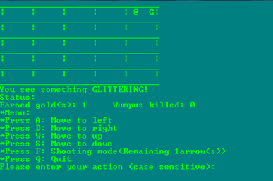

# 👻 Wumpus

<center></center>

> `Hunt the Wumpus` is a video game, based on a simple hide and seek format featuring a mysterious monster (the Wumpus) that lurks deep inside a network of rooms.

---

## NOTE ✋ ⚠️  This only works only on `Windows`

---

## 🚀 Getting Started


1. ``` $ git clone https://github.com/ragmha/wumpus.git```

2. Open the file on [Microsoft Visual Studio](https://www.visualstudio.com/vs/) or other < your ♥️ IDE >

3. Compile and Run! 🚀


## License
[MIT](./license) © [Raghib Hasan](http://raghibm.com/)
